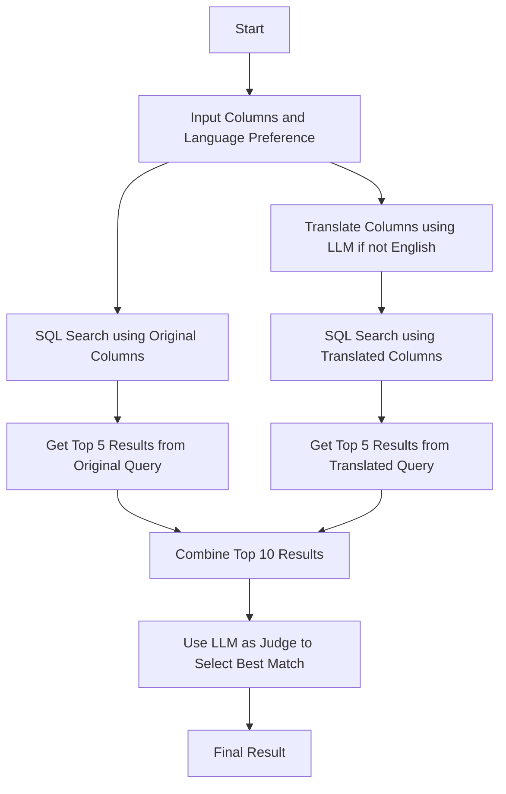

```mermaid
graph TD
    A[Start] --> B[Input Columns and Language Preference]
    B --> C[SQL Search using Original Columns]
    B --> D[Translate Columns using LLM if not English]
    D --> E[SQL Search using Translated Columns]
    C --> F[Get Top 5 Results from Original Query]
    E --> G[Get Top 5 Results from Translated Query]
    F --> H[Combine Top 10 Results]
    G --> H
    H --> I[Use LLM as Judge to Select Best Match]
    I --> J[Final Result]
```
